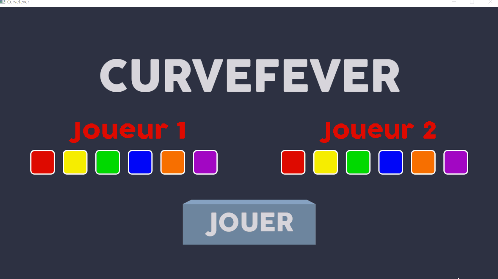

# CurveFever

Jeu codé en C++ avec la bibliothèque graphique SDL2

Vidéo présentation du jeu :


## En quoi consiste le jeu ?
+ Deux joueurs s'affrontent à l'aide d'un seul clavier, chacun contrôle un serpent et doit rester le plus longtemps possible en vie
+ Les contrôles sont les touches __*Q*__ et __*D*__ pour le joueur 1, __*K*__ et __*M*__ pour le joueur 2
+ Chacun doit éviter les bords du terrain et les traces des serpents pour rester en vie et marquer un point
+ Le premier joueur à 5 points remporte la partie

## Comment lancer le jeu ?
+ Une fois le dossier téléchargé il vous faudra g++ d'installé pour compiler le projet
+ De là on utilise le Makefile avec la commande ```make ``` à la base du projet
+ Puis on exécute le programme avec ```.\bin\curvefever.exe ```
